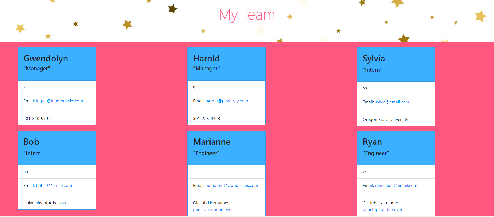

# Team-Profile-Generator

##Description
This Node CLI HTML generator is an easy and cheerful way to keep track of your team members! I learned A LOT doing this one. Better use of Node, writing tests with Jest, how to render HTML from the command line.

##Installation
Clone the repo, install your npms, npm run test to check for errors, and npm start to start the application. 

##Usage
Here is a link to a demo showing how to use it: https://drive.google.com/file/d/1VwE8zxtABkfI1XqaZsri6LJ_lNP5CdXS/view
Answer the questions, then right-click team.html in the Sample folder, and select Open With Live Server. And there it is!

